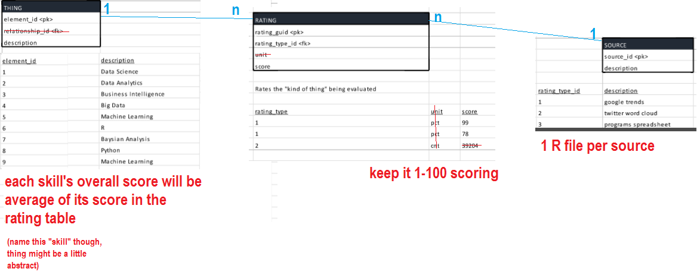
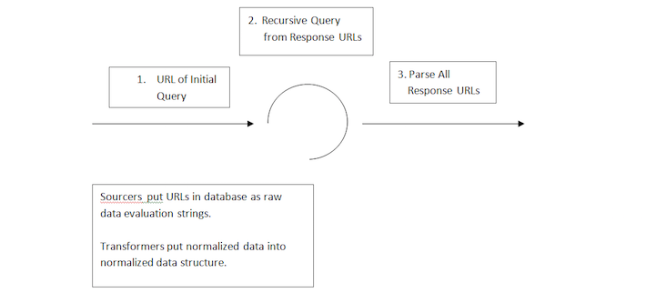
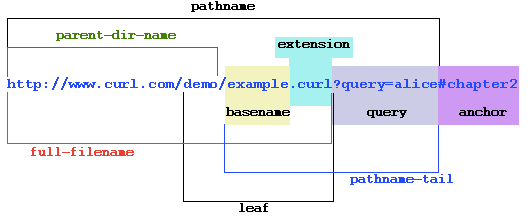
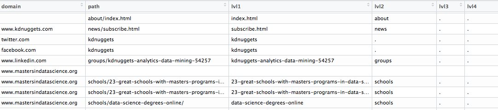

Load libraries
```{r load-library, eval=TRUE, include=FALSE}
library("XML")
library("RCurl")
library("urltools")
library("dplyr")
library("knitr")
```
###Introduction To "Search"

The objective of this utility is to model a simple approach for searching a web-based data source for a few key words
and applying this model to "data science skills".  This segment of the utility focuses on sourcing the result set from
a Google query and return the result set in a usable format to the transformer segment.  

Development started off by initiating a conversation about how to model the data we collect from matching skills and rating them.  "Search"", "source", "match"" and "rate" were general themes persistent throughout the project.  

1. The Data Model


#####Excerpted dialogue:  
The issue I want to discuss . . . is “search”.  We could query the term: “Data Science” with the filter: “skills”, get the results from each source and be done.  If we take a more expansive approach, we can include queries with synonyms such as the term: “Data Analytics” with the term qualifier: “professional skill” or subsets a term such as: “Big Data” skill: “R”.

The idea is to evaluate the sources . . . but to generalize the categorization engine that evaluates . . . them.
This may be useful if we get a lot of different types of data to compare.

. . . maybe we should start simpler - what do you think of a subset

  * there are a list of skills in the DB
  * there are a bunch of different R scripts/source pairs that use different strategies at rating those skills
  * we use a cross table to score/join the "thing" with the "source"
  * the final skill score is the average of what the different tools scored that skill in the cross table...
 
. . . look into whether the . . . “evaluator” can handle the following:
 
·         Source (Google Trends, Twitter)
·         Query term (Data Science)
·         Filter (skills)
·         Variants (synonyms, subsets)
·         Result (score)
·         Result Classification (Rank, Count, Percentage, Mean)


2. Start by initializing a helper function - getLinks - to get child links
http://stackoverflow.com/questions/25213983/explanation-of-how-this-complex-function-works
```{r getlinks-function, eval=TRUE, include=TRUE}
getLinks <- function() { 
   links <- character() 
   list(a = function(node, ...) { 
               links <<- c(links, xmlGetAttr(node, "href"))
               node 
            }, 
        links = function()links)
}
```


3. GOOGLE -  search for "data science skills"  *Note, Google obscures its initial results to prevent hacking.


```{r set-urls, eval=TRUE, include=FALSE}
url1 <- getURL("http://www.kdnuggets.com/2014/11/9-must-have-skills-data-scientist.html" ,ssl.verifypeer = FALSE)
url2 <- getURL("http://www.mastersindatascience.org/careers/data-scientist/" , ssl.verifypeer = FALSE)
url3 <- getURL("http://dataconomy.com/top-10-data-science-skills-and-how-to-learn-them/", ssl.verifypeer = FALSE)
url4 <- getURL("http://blog.udacity.com/2014/11/data-science-job-skills.html", ssl.verifypeer = FALSE)
url5 <- getURL("https://www.quora.com/What-are-the-most-valuable-skills-to-learn-for-a-data-scientist-now", ssl.verifypeer = FALSE)
url6 <- getURL("https://datajobs.com/what-is-data-science" , ssl.verifypeer = FALSE)
url7 <- getURL("https://adtmag.com/articles/2016/01/08/data-science-skills.aspx", ssl.verifypeer = FALSE)
url8 <- getURL("http://www.datanami.com/2016/01/07/what-data-science-skills-employers-want-now/", ssl.verifypeer = FALSE)
url9 <- getURL("http://www.informationweek.com/big-data/big-data-analytics/data-science-skills-to-boost-your-salary/d/d-id/1323116", ssl.verifypeer = FALSE)
url10 <- getURL("http://stackoverflow.com/questions/2860314/essential-skills-of-a-data-scientist", ssl.verifypeer = FALSE)
```

4. Collect a result set of child urls from the initial result set of 10 


```{r get-child-links, eval=TRUE, include=FALSE}
filterLinks <- getLinks()
htmlTreeParse(url1, handlers = filterLinks)
df1 <- data.frame(filterLinks$links())

filterLinks <- getLinks()
htmlTreeParse(url2, handlers = filterLinks)
df2 <- data.frame(filterLinks$links())

filterLinks <- getLinks()
htmlTreeParse(url3, handlers = filterLinks)
df3 <- data.frame(filterLinks$links())

filterLinks <- getLinks()
htmlTreeParse(url4, handlers = filterLinks)
df4 <- data.frame(filterLinks$links())

filterLinks <- getLinks()
htmlTreeParse(url5, handlers = filterLinks)
df5 <- data.frame(filterLinks$links())

filterLinks <- getLinks()
htmlTreeParse(url6, handlers = filterLinks)
df6 <- data.frame(filterLinks$links())

filterLinks <- getLinks()
htmlTreeParse(url7, handlers = filterLinks)
df7 <- data.frame(filterLinks$links())

filterLinks <- getLinks()
htmlTreeParse(url8, handlers = filterLinks)
df8 <- data.frame(filterLinks$links())

filterLinks <- getLinks()
htmlTreeParse(url9, handlers = filterLinks)
df9 <- data.frame(filterLinks$links())

filterLinks <- getLinks()
htmlTreeParse(url1, handlers = filterLinks)
df10 <- data.frame(filterLinks$links())

filterLinks <- getLinks()
htmlTreeParse(url10, handlers = filterLinks)
df_url10 <- data.frame(filterLinks$links())
```


5. Parse and extract key words from the result set . . .  



```{r reshape-urls, eval=TRUE, include=TRUE}
# aggregate urls 
df_links <- rbind(df1,df2,df3,df4,df5,df6,df7,df8,df9,df10)
#str(df_links)
head(df_links)

# break urls into  domain and path components
df_url_parsed <- url_parse(as.character(df_links$filterLinks.links))
df_url_parsed <- data.frame(df_url_parsed)[,c(2,4)]
#str(df_url_parsed)
head(df_url_parsed)

# split the path components into 7 word elements
df_url_parsed["lvl1"] <- basename(df_url_parsed$path)
df_url_parsed["lvl2"] <- basename(dirname(df_url_parsed$path))
df_url_parsed["lvl3"] <- basename(dirname(dirname(df_url_parsed$path)))
df_url_parsed["lvl4"] <- basename(dirname(dirname(dirname(df_url_parsed$path))))
df_url_parsed["lvl5"] <- basename(dirname(dirname(dirname(dirname(df_url_parsed$path)))))
df_url_parsed["lvl6"] <- basename(dirname(dirname(dirname(dirname(dirname(df_url_parsed$path))))))
df <- df_url_parsed %>%
        select(lvl1,lvl2,lvl3,lvl4,lvl5,lvl6,domain,path)
```

6. Parsed urls!  



###This is the ugly part!
###It would be better done on the database against a dictionary of distinct skills
We 'the sourcers' weren't able to develop an authoratative dictionary of skills that could be x-referenced at 
the sourcing stage of development.  This was developed by the transformers and perhaps with more time could be 
introduced at the point data is retrieved.  This was an initial pass at matching the data by trial and error.  
'Emphasis on error'

7. Subset result set to match skills    

```{r ugly-matching, eval=TRUE, include=TRUE}    
df[,1] <- gsub("\\.com|\\.html", " ", df[,1])
df[,1] <- gsub("\\s{2,}|\\d+|[[:punct:]]", " ", df[,1])
df[,1] <- gsub("edit|help|free|make|more|uwsp|hire|your|must|have|goes|udemy", "", df[,1])
#df[,1] <- gsub(" a | and|the |who |jpg|tips|top |new|job|for | in |is | us | one |if |to |get |tma |bad |mba| ms |aspx|law |fake|ways|spot|at |umuc|id ", "", df[,1])
df[,1] <- gsub("the | job |who ","",df[,1])
df[,1] <- gsub("fix |vs |usa| or |tips|mq |d d|paw|aust|mar|avp| asa |know|to see |much|why  |wine", "", df[,1])
df[,1] <- gsub("index|login|money|knew |every|thing|chair|works|steps|flow |easy|last |says|when|about|match|made| you", "", df[,1])
df[,1] <- gsub("master|signup|skills|advice|summer|burtch|hired|april|tweets|great|good|week|with|sports|learn them| need", "", df[,1])
df[,1] <- gsub("skytree|career|schools|stories|hiring|become|philip|maymsports|academy|dataconomy|guide|does|best", "", df[,1])
df[,1] <- gsub("opinions|revision|subscribe|webinars|require|seven|gartner|flash|section|gbdc|course|lawyers", "", df[,1])
df[,1] <- gsub("kdnuggets|interview|bootcamps|ontotext|required|unicorn|questions|answers|canada|scikit|next big|wind|tutorial|articles", "", df[,1])
df[,1] <- gsub("data science|data scientist|professor|offerings|programs|possible|becoming|bootcamp|datacamp|peachih|weather|experts|expect", "", df[,1])
df[,1] <- gsub("fundamentals|automated|certificates|certificate|fellowship|specialties|disappoints|gainers|losers|s program|influence", "", df[,1])
df[,1] <- gsub("google tensor|gooata science|tensor learn|explained|tutorials|inflection|opening|continuum|medicine|training", "", df[,1])
df[,1] <- gsub("usa|san francisco|niagara falls|alabama|arizona|arkansas|california|colorado|connecticut|florida|georgia|hawaii", "", df[,1])
df[,1] <- gsub("beginners|dataconomy|heaven|certification|srch|ko|htm|how|salary|future|terms of use|driving|announcing|opportunities", "", df[,1])
df[,1] <- gsub("rediscovered|manulife|specialist||tedtalks|advanced|open ch| world|degrees|prosensus|quandl|doctorate|events| from sas horton", "", df[,1])
df[,1] <- gsub("top stories|stackoverflow|dissapoints|stackexchange|interviews|nate silver|startups|cheat sheets|learning both|list|forms", "", df[,1])
df[,1] <- gsub("healthcare|profile|document|message|share|article|archive|contact|contact us|essential of| chesheets","",df[,1])
df[,1] <- gsub(" amsterdam| barcelona| berlin| brussels| budapest| dusseldorf ln| frankfurt| hamburg| munich| paris| stockholm| vienna| istanbul","",df[,1])
df[,1] <- gsub(" tel aviv|london|t necessary learn|","",df[,1])
df[,2] <- gsub("\\d+","",df[,2]) 
df[,2] <- gsub("d-id|course|blog|tag|careers|industry|data-science|tracks|data-scientist-skills|specialties|groups|community-brands","",df[,2])
df[,2] <- gsub("multimedia|whitepaper|this-just-in|vendor|application|sector|topic|wiki|-pages|education|big-data-analyst-salary|intent","",df[,2])
df[,2] <- gsub("technology|event|reports|ideas|event|list|formsa-hoic-approach-to-countering-insider-threats|airbnb|answers|apps|class","",df[,2])
df[,2] <- gsub("computer-and-information-|create|cut-your-costs-with-netsupport-dna|daily-life|data|data-scientists-|datanami|ds|legal||nl|ottawa","",df[,2])
df[,2] <- gsub("electrical-engineering-and-computer-science|en|framework|ged|go|gogreen|help|jobs-and--in-|key-tools-for-hybrid-cloud|thesis","",df[,2])
df[,3] <- gsub("\\d+","",df[,3])
df[,3] <- gsub("v|d|questions|pages|jobs|certification|framework|topics|training|courses|articles|whitepapers|webcasts","",df[,3])
df[,3] <- gsub("insight|pin|store|what-are-the-most-aluable-skills-to-learn-for-a-ata-|post|alexaner-lees|kickoff|ooh|resources","",df[,3])
df[,3] <- gsub("watersworks|prouctiity|acaemic","",df[,3])
df[,4] <- gsub("\\d+","",df[,4])
df[,4] <- gsub("data-science-skills-to-boost-your-salary|big-data-brings-big-security-problems|are-you-recruiting-a-data-scientist-or-unicorn","",df[,4])
df[,4] <- gsub("-state-of-database|in-a-fever-for-big-data|where-data-science-meets-it-|windows--inside-nyc-launch-day","",df[,4])
df[,4] <- gsub("windows--inside-nyc-launch-day|the-age-of-biotechnology-has-arrived|-cloud-startups-worth-your-attention","",df[,4])
df[,4] <- gsub("-hot-it-jobs-that-deliver-work-life-balance|files|uploads|training|certification|profile|blogs|images|watersworks|blog","",df[,4])
df[,4] <- gsub("guest|category|go|whitepapers|webcasts","",df[,4])
df[,5] <- gsub("\\d+","",df[,5])
df[,5] <- gsub("big-data-analytics|wp-content|guest|articles|abstract|whitepaper|adtmag|blogs|it-life","",df[,5])
df[,6] <- gsub("\\d+","",df[,6])
df[,6] <- gsub("blog.udacity.com|ecg","",df[,6])


df <- df %>% filter(lvl1 != "")
df <- df %>%
          filter(
            lvl1 != ""  & 
            lvl1 != "s"  &
            lvl1 != "datascientist isnt being inventive" &
            lvl2 != 'schools' & 
            lvl2 != 'certification' & 
            lvl2 != "author" & 
            lvl2 != "+udacity" &
            lvl2 != "about" &
            lvl2 != "course" &
            lvl2 != "news" &       
            lvl2 != "category" &                     
            lvl2 != "q" &                                   
            lvl2 != "a" &                                   
            lvl2 != "company" &                                   
            lvl2 != "profile" &                                   
            lvl2 != "readings" &                                   
            lvl2 != "api" &                                   
            lvl2 != "gampad" &                                   
            lvl2 != "pages" &                                                 
            lvl2 != "jobs" &                
            lvl2 != "software" &                           
            lvl2 != "opinions" &
            lvl2 != "datasets" &     
            lvl2 != "sharer" &        
            lvl2 != "users" &                    
            lvl2 != "s"  &     
            lvl2 != "p"  &              
            lvl2 != "meetings"  &     
            lvl2 != "academic"  &     
            lvl2 != "tutorials"  &     
            lvl2 != "companies"  &     
            lvl2 != "polls"  &                 
            lvl2 != "salaries"  &     
            lvl2 != "webcasts"  &     
            lvl2 != "unanswered"  &     
            lvl2 != "sets"  &     
            lvl2 != "skills"  &     
            lvl2 != "forms"  &                 
            lvl2 != "catery"  &     
            lvl2 != "questions"  &                 
            lvl2 != "www.reddit.com"  &     
            lvl2 != "forms"  &
            lvl2 != "catery"  &     
            lvl2 != "top--reasons-to-ctralize-your-business-communications"  &
            lvl2 != "survey-report:-the-value-of-threat-intelligce-in-protection"  &
            lvl2 != "the-forrester-wave:-digital-experice-platforms,-q-"  &
            lvl2 != "a-hoic-approach-to-countering-insider-threats"  &
            lvl2 != "forms"  &                 
            lvl2 != "question"  &     
            lvl2 != "stackexchange.com"  &
            lvl3 != "sitemap" &  
            lvl3 != "eents" &
            lvl3 != "posts" &
            lvl3 != "certify" &
            lvl3 != "us" &
            lvl3 != "s"  &     
            lvl3 != "mastersinata" &
            lvl3 != "profiles" &
            lvl3 != "users" &       
            lvl3 != "category" &
            lvl3 != "mark-meloon" &
            lvl3 != "lasegas" &
            lvl3 != "sites" &
            lvl3 != "licenses" &
            lvl3 != "what-are-the-most-aluable-skills-to-learn-for-a-ata-" &
            lvl3 != "scientist-now" &
            lvl3 != "ata-scientist-the-sexiest-job-of-the-st-century" &
            lvl4 != "googles-next-hq-modern-with-retro-flairs-" &
            lvl4 != "everything-youve-been-told-about-mobility-is-wrong"&
            lvl6 != "content" & 
            lvl6 != "webcasts" & 
            lvl6 != "strategic-cio"
      )

df[df=="."] <- ""
df[,1] <- gsub("whitepaper|^s |asp|history|like see |easier|adopt|bashos|john|musser|stacver|tweet|perfect pairing","", df[,1])
df[,1] <- gsub("essential of|privacy|sites|adt tech library|mediadata||home|radio|i want be|essential of a|us ","", df[,1])
df[,1] <- gsub("^\\s+|\\s+$", "", df[,1])

df[,1] <- gsub("php|thjust in| spark","", df[,1])
df <- df %>% filter(lvl1 != "")
```

8. Summarize results and output to file
```{r prepare-for-output,eval=TRUE,include=TRUE}
df_out <-
        df %>%
        select(lvl1)  %>%
        group_by(lvl1) %>%
        summarise(score= n()) %>%
        arrange(desc(score))

write.csv(df_out, file = "google.csv")
```

9.  Lessons learned

### Matching Engine
Step 7 of this data sourcing exercise was unecessarily laborious and inaccurate.  At best, this can be attributed 
to a discovery process.  It became apparent early-on however, that a source-skill lookup would be a more effective 
way to handle matching and the database which is optimized for this purpose may be more ideally suited for the matching function that R.

### Process Improvement
Ideally, with each pass through the matching cycle the list of skills improves.  The skills can further
be classified through meta-data.  Variants on the initial query should becoome incorporated such as "data analytics" 
"business intelligence" etc. and the result sets should also be classified i.e. technical skills, soft skills, skill
concentration by location, industry etc.

The notion is that each cycle of matching and classification improves the ultimate search result.